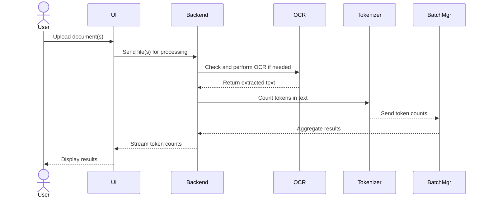

# Token-Calculator

**Accurate token counting for your documents with real GPT tokenization**

Token-Calculator accurately counts GPT tokens in PDF TXT DOCX MD and PPTX files. It features streaming extraction constant-memory processing OCR detection batch processing and a Hugging Face Spaces-ready Gradio UI.

---

## Table of Contents

- [Introduction](#introduction)
- [Features](#features)
- [Architecture](#architecture)
- [Workflow](#workflow)
- [Tech Stack](#tech-stack)
- [Installation](#installation)
- [Project Structure](#project-structure)
- [Usage](#usage)

---

## Introduction

Counting tokens in diverse document formats is critical for LLM preprocessing RAG ingestion and enterprise analytics. Existing tools often rely on approximations or lack support for scanned PDFs and batch workflows.

Token-Calculator solves these challenges by providing precise real GPT token counts across popular document types with OCR detection and efficient streaming extraction. Developers and teams building LLM-powered apps RAG pipelines or analytics workflows benefit from its accuracy and performance.

| Feature                   | Token-Calculator | Alternative A | Alternative B |
|---------------------------|------------------|---------------|---------------|
| Real GPT tokenization     | ✅               | ❌            | ❌            |
| Streaming constant-memory | ✅               | ❌            | ❌            |
| OCR/scanned PDF detection | ✅               | ❌            | ❌            |
| Batch processing          | ✅               | Limited       | ❌            |
| Hugging Face Spaces UI    | ✅               | ❌            | ❌            |
| Timeout enforcement       | ✅               | ❌            | Limited       |

---

## Features

### Core Features

- 🧮 **Real GPT token counting** using tiktoken for accurate token numbers  
- 📄 **Supports PDF TXT DOCX MD PPTX** file formats with robust parsing  
- 🔄 **Streaming single-pass extraction** with constant memory footprint  
- ⏱️ **Timeout enforcement and adaptive concurrency** for reliability  
- 🧩 **Batch processing** for efficient multi-file token counting  

### Developer Experience

- 🧪 **Process-safe architecture** ensures stability in concurrent environments  
- 🔒 **Memory protection** to prevent leaks in large document processing  
- 🔑 **Streaming SHA256 hashing (optional)** for integrity verification  

### Deployment

- 🚀 **Hugging Face Spaces-ready Gradio UI** for quick demos and sharing  
- 📦 **Lightweight dependencies** and easy integration into pipelines  

---

## Architecture

```mermaid
flowchart LR
    InputLayer[Input Layer Documents]
    Extraction[Streaming Extraction Layer]
    Tokenization[GPT Tokenization Layer]
    OCRDetection[OCR Scanned PDF Detection]
    BatchProcessor[Batch Processing Manager]
    TimeoutManager[Timeout and Concurrency]
    OutputLayer[Output Layer Token Counts]
    UI[Gradio UI]

    InputLayer --> Extraction
    Extraction --> OCRDetection
    OCRDetection --> Tokenization
    Tokenization --> BatchProcessor
    BatchProcessor --> TimeoutManager
    TimeoutManager --> OutputLayer
    UI --> InputLayer
    OutputLayer --> UI
```



| Component           | Role                                      | Technology       |
|---------------------|-------------------------------------------|------------------|
| Input Layer         | Accepts documents and metadata             | Python pathlib   |
| Streaming Extraction| Single-pass file reading with constant memory | Custom streaming code|
| GPT Tokenization    | Counts tokens using official tiktoken     | tiktoken        |
| Batch Processing    | Manages multi-file token counting          | Async Python     |
| Timeout and Concurrency | Enforces limits and adapts concurrency   | Asyncio          |
| Output Layer        | Returns token counts and metadata           | JSON/Markdown    |
| Gradio UI           | Interactive user interface                   | Gradio           |

---

## Workflow



1. User uploads one or more documents via the Gradio UI.  
2. UI sends files to the backend processing service.  
3. Backend checks if PDFs require OCR and performs it if necessary.  
4. Extracted text is passed to the GPT tokenization module using tiktoken.  
5. Token counts are sent to the batch manager to aggregate if multiple files.  
6. Backend streams aggregated token counts back to the UI.  
7. UI displays token counts in real time to the user.  

---

## Tech Stack

| Layer            | Technology     | Purpose                                  |
|------------------|----------------|------------------------------------------|
| UI               | Gradio         | Interactive web interface                 |
| Tokenization     | tiktoken       | Accurate GPT token counting               |
| Document Parsing | Python libraries| Reading PDF TXT MD DOCX PPTX              |
| OCR              | OCR toolkits   | Detecting and extracting scanned PDFs    |
| Concurrency      | Asyncio        | Adaptive concurrency and timeout control |
| Hashing          | hashlib (SHA256)| Optional streaming file integrity check |

---

## Installation

### Prerequisites

- Python 3.8 or higher  
- pip package manager  
- Optional: Tesseract OCR installed for scanned PDF support  

### Quick Start

```bash
git clone https://github.com/Pranesh-2005/Token-Calculator.git
cd Token-Calculator
pip install -r requirements.txt
```
---

## Project Structure

```
Token-Calculator/
├── app.py                # Gradio UI application entrypoint
├── core.py               # Core token counting and extraction logic
├── requirements.txt      # Project dependencies
├── README.md             # This documentation
```

---

## Usage

### Basic Example

Count tokens in a single PDF file using the Python API:

```python
from core import count_file

result = count_file("sample.pdf")
print(f"Token count in sample.pdf is {result['token_count']}")
```

### Advanced Example

Batch count tokens in multiple documents with timeout and hashing enabled:

```python
from core import count_files_batch

files = ["doc1.pdf", "notes.md", "presentation.pptx"]
results = count_files_batch(files, timeout_seconds=120, enable_hashing=True)

for res in results:
    print(f"{res['filename']} tokens {res['token_count']} SHA256 {res.get('sha256')}")
```

---

<div align="center">

[](https://www.python.org/)
[](LICENSE)
[](https://github.com/Pranesh-2005/Token-Calculator/stargazers)
[](https://github.com/Pranesh-2005/Token-Calculator/issues)

</div>

## License
This project is licensed under the **MIT** License.

---
🔗 GitHub Repo: https://github.com/Pranesh-2005/Token-Calculator